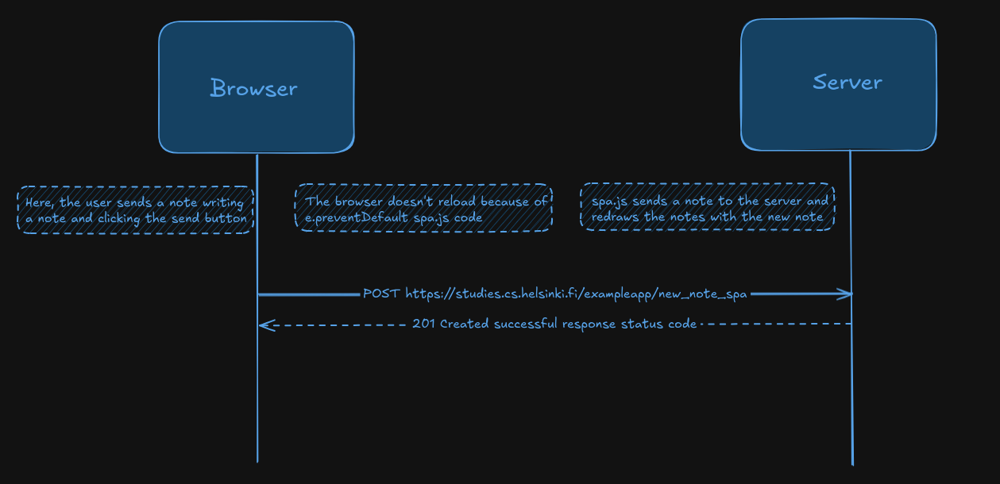

# Part 0

Exercises from https://fullstackopen.com/en/part0/fundamentals_of_web_apps#single-page-app

Diagrams made in excalidraw

Used https://developer.mozilla.org/en-US/docs/Web/HTTP/Reference for the meaning of status codes

## Diagrams

